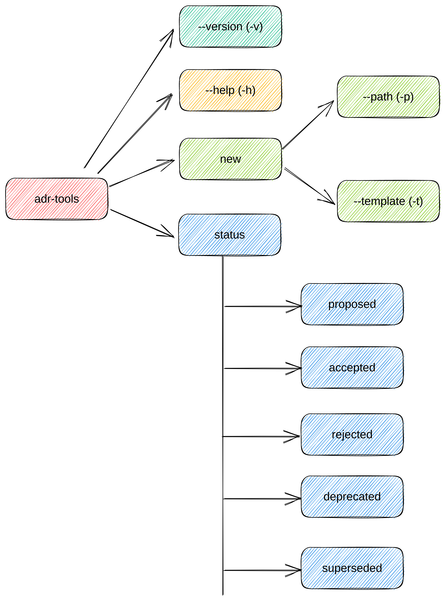

# Общая архитектура

## Статус

*Какой статус, такой как предлагаемый (proposed), принятый (accepted), отклоненный(rejected), устаревший (deprecated), заменен (superseded) и т.д.?*

2023-05-07 предлагаемый

## Контекст

*Какая проблема мотивирует это решение или изменение?*

Как будет выглядеть архитектура для adr-tools в виде cli (MVP-версия).

## Решение

*Какое изменение мы предлагаем и/или делаем?*

Из [ADR MVP](./0001-mvp.md) известно какие будут фитчи. Т.к. для реализации инструмента используется интерфейс в виде консольного ввода (CLI - command line interface), то нужно описать команды и их аргументы данного инструмента и что будет ожидаться после их выполнения.



### Команды version и help

```sh
# команда для получение текущей версии либы 
adr-tools --version
adr-tools -v
# пример вывода
# v1.0.1
```

```sh
# команда для получения помощи
# выводит список всех команд и краткое описание
adr-tools --help
adr-tools -h
```

```sh
# выводит детальное описание по конкретной команде
adr-tools --help <command_name>
# примеры
adr-tools --help new
adr-tools -h status
```

### Создания ADR

```sh
# команда для создания ADR
adr-tools new <adr_name> [options]
# примеры
# равнозначные команды для создание ADR
adr-tools new init
adr-tools new init --template default 
adr-tools new init -t default
adr-tools new init -t nygard 
adr-tools new init --path ./docs/adr
adr-tools new init -p ./docs/adr
adr-tools new init --template default --path ./docs/adr
adr-tools new init -t nygard -p ./docs/adr
# на выходе создадут ADR: ./docs/adr/0001-init.md с темлейтом от Michael Nygard 
```

### Изменение статуса ADR

```sh
# команда для изменения статусы ADR
adr-tools status <id> -s <status>
# примеры
adr-tools status 1 -s proposed
adr-tools status 1 -s accepted
adr-tools status 1 -s rejected
adr-tools status 1 -s deprecated
adr-tools status 1 -s superseded
# в результате в конкретной ADR добавляется новый статус в разделе Статус(Status)
```

## Последствия

*Что становится проще или труднее сделать из-за этого изменения?*

1. Будут реализованы базовые команды: version, help, new, status. Это позволит реализовать MVP и создать задел для будущих фитч.
2. Как уже говорилось ранее, на этапе MVP проект будет выглядеть "беднее" аналогов.
